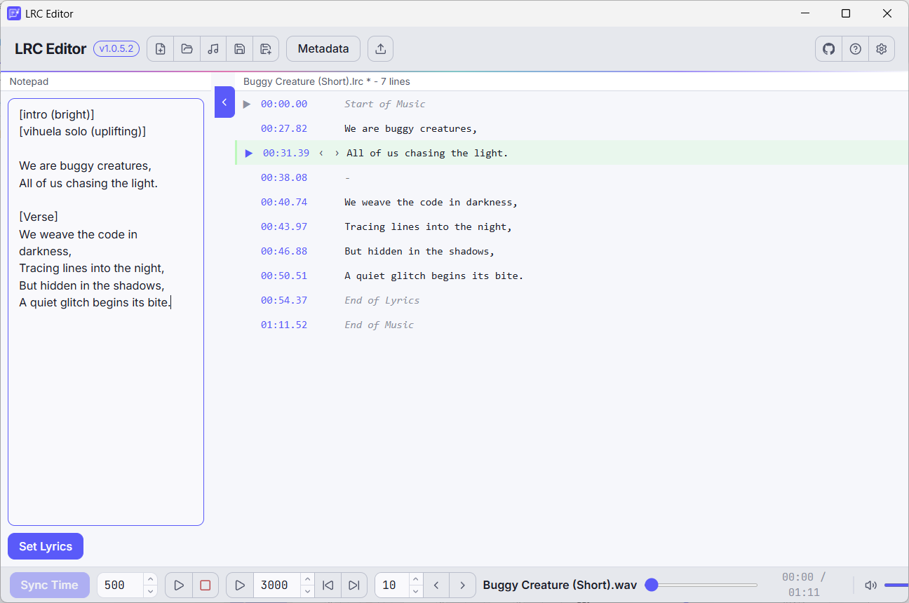

<p align="center">
  
</p>

<h1 align="center">LRC Editor</h1>

<div align="center">
  <strong>One keypress per line. That is the whole sync.</strong><br>
  Create and time-sync <code>.lrc</code> lyric files against the track, with reaction-delay compensation and a hands-free verify pass.
</div>

<br>

<!-- readme:nav -->

<div align="center">
  <a href="../../releases/latest"></a>
  <a href="../../releases"></a>
</div>

<h3 align="center">
  <a href="https://apps.yaiol.com/en/p/lrc-editor/">Website</a>
  <span>&nbsp;·&nbsp;</span>
  <a href="#install">Install</a>
  <span>&nbsp;·&nbsp;</span>
  <a href="#features">Features</a>
  <span>&nbsp;·&nbsp;</span>
  <a href="#documentation">Documentation</a>
  <span>&nbsp;·&nbsp;</span>
  <a href="#build-from-source">Development</a>
</h3>

<div align="center">
  <sub><a href="https://apps.yaiol.com/en/p/lrc-editor/help/"><b>Help in 27 languages</b></a></sub>
</div>

<!-- /readme:nav -->

---

<p align="center">
  
</p>

---

## Install

| Windows | macOS | Linux |
|:---:|:---:|:---:|
| [](../../releases/latest) | [](../../releases/latest) | [](../../releases/latest) |
| x64 installer | Intel and Apple Silicon | portable AppImage |

> **Windows note:** SmartScreen may warn on first launch because the app is not code-signed. Click "More info", then "Run anyway".

---

## What it is

`.lrc` files are what make lyrics scroll in sync with a song in music players and karaoke apps. Producing them by hand is tedious: every line needs an accurate timestamp.

LRC Editor turns that into a single-keypress flow. Load a track, get your lyric lines into the editor, then press one key on each line as the song plays - the current playback position is stamped on the spot, and the selection advances automatically. A built-in reaction-delay compensation corrects for the gap between hearing a line and pressing the key, and a hands-free Verify pass plays the finished file back so you can catch any stamp that drifted.

---

## Features

- **Real-time sync** - stamp the current playback position onto a lyric line with a single keypress.
- **Reaction-delay compensation** - subtract a configurable delay to correct for human response time.
- **Verify pass** - play the finished file back hands-free, auto-advancing through every line to catch stamps that land early or late.
- **Time nudge and global offset** - shift individual lines in configurable millisecond steps, or the whole file at once via the LRC offset tag.
- **Reads your files** - import `.lrc` and `.txt`, export `.lrc` and plain `.txt`, and auto-load a matching `.lrc` when you open an audio file.
- **Reads your tags** - title, artist, album and duration straight from the audio (mp3, flac, m4a, and more).
- **Notepad panel** - paste raw lyrics, then bulk-import them into the editor in one click.
- Undo / redo with a 50-level stack, dark and light themes, 3 fonts, and dozens of interface languages including RTL and CJK scripts.

---

## Documentation

| | |
|---|---|
| **User manual** | [Read it online](https://apps.yaiol.com/en/p/lrc-editor/help/) |
| **Printable PDF** | attached to each [release](../../releases/latest) |
| **What's new** | [Release notes](https://apps.yaiol.com/en/p/lrc-editor/help/releases/) |
| **Product page** | [apps.yaiol.com](https://apps.yaiol.com/en/p/lrc-editor/) |

---

## Build from source

```bash
npm install
npm run electron:dev   # React (Vite) dev server + Electron together
```

Build platform installers:

```bash
npm run dist        # Windows x64 installer
npm run dist:mac    # macOS DMG
npm run dist:linux  # Linux AppImage
```

---

## Architecture

A React front-end (built with Vite) talks to an Electron + Express back-end over a local HTTP API - the standard yaiol Electron shape. There is no database; settings live in `localStorage`. The Express layer handles all file I/O (open/save `.lrc` and `.txt`), reads audio metadata, and - notably - streams the audio itself.

| Layer | Technology |
|---|---|
| UI framework | React 19 |
| Build tool | Vite |
| Desktop shell | Electron 41 |
| Local API | Express 5 |
| Audio metadata | music-metadata 11 (+ manual FLAC parser) |
| Packaging | Electron Builder |

<details>
<summary><b>Audio streaming — Express byte-range, not a custom protocol</b></summary>

Audio is served through a plain Express route, `GET /audio?path=<base64>`, with **HTTP byte-range (206) support**. This is what makes seeking responsive in large audio files: the `<audio>` element requests only the byte range it needs rather than downloading the whole track. The full URL (including the dynamic API port) is built server-side and returned by `/open-music`, so the renderer uses it as-is for `audio.src`. Supported formats: mp3, wav, ogg, opus, flac, m4a, aac.

</details>

<details>
<summary><b>Metadata — music-metadata with a manual FLAC fallback</b></summary>

Tag and duration reading uses the [`music-metadata`](https://www.npmjs.com/package/music-metadata) library. Some otherwise-valid FLAC files make it throw "Invalid FLAC preamble"; the back-end catches that and falls back to an in-house binary parser that reads STREAMINFO (duration) and VORBIS_COMMENT (tags) straight from the FLAC block structure. This fallback is load-bearing for FLAC support.

</details>

---

## License

Released under the [MIT License](LICENSE).

<div align="center">
  <sub>LRC Editor is part of <a href="https://apps.yaiol.com">yaiol Applications</a>.</sub>
</div>
